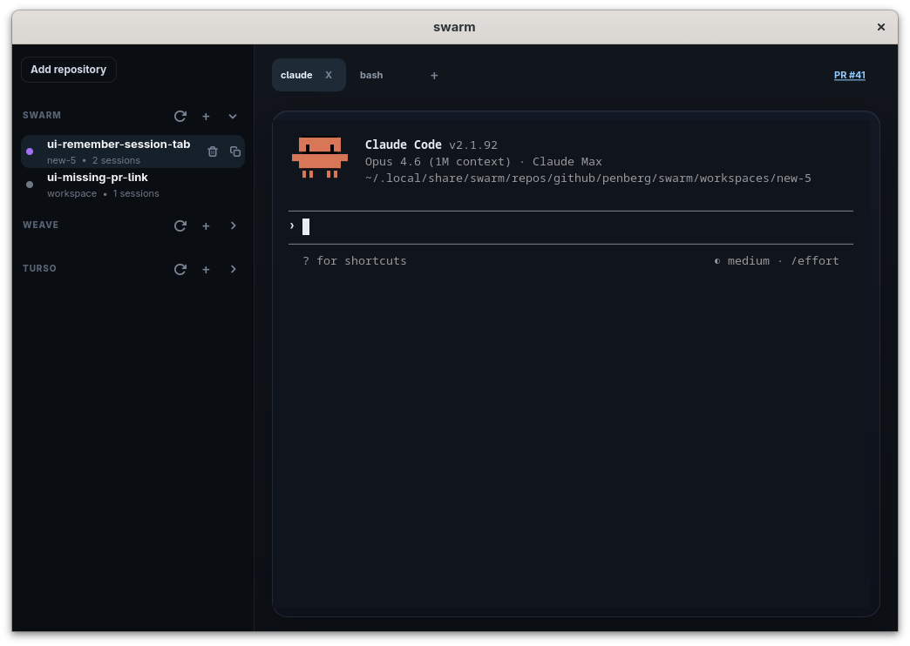

<p align="center">
  
</p>

# Swarm

A workspace manager for parallel development. Register git repositories, spin up isolated worktrees, and run persistent terminal sessions inside them — from the CLI or a native GTK desktop app.

## Motivation

Coding agents are most effective when you can run many of them in parallel — one per feature, one per bug fix. But in practice, this quickly turns into chaos. Each agent needs its own copy of the source code so they don't step on each other's changes, and each one runs in its own terminal. Before long, you're drowning in terminal tabs, losing track of which agent is working on what, and manually juggling git branches and directories.

Swarm exists to tame that. It gives you a single place to manage all your repositories, workspaces, and agent sessions — so you can scale up the number of parallel agents without the overhead of keeping it all organized yourself.

## How it works

Swarm organizes work into **repositories**, **workspaces**, and **sessions**. A repository is the git repository that holds your project's source code. A workspace is an isolated copy of that source code, backed by a git worktree, where work happens independently without interfering with other workspaces. A session is a persistent terminal environment running inside a workspace — it could be a coding agent, a shell, or any long-running command.

For example, a typical **workspace-per-feature** workflow looks like this: create a workspace for every feature or bug fix, let a coding agent work on it in a session, submit a pull request, address review comments and iterate — all within the same workspace. When the work is merged to mainline, remove the workspace.

## Building

The GTK desktop app depends on GTK 4 development headers and a Zig toolchain for the vendored `libghostty-vt` build. Swarm currently requires `zig 0.15.2`.

On Ubuntu/Debian, install the same system packages used by the release build:

```sh
sudo apt install gcc g++ libcairo2-dev libglib2.0-dev libgtk-4-dev libpango1.0-dev pkg-config
```

Then install Zig 0.15.2 and make sure `zig` is on your `PATH`.

Build the full application:

```sh
cargo build
```

Without the GTK UI and its native prerequisites:

```sh
cargo build --no-default-features
```

## Documentation

See [MANUAL.md](MANUAL.md) for the full reference.

## License

Swarm is available under the [MIT license](LICENSE.md).
